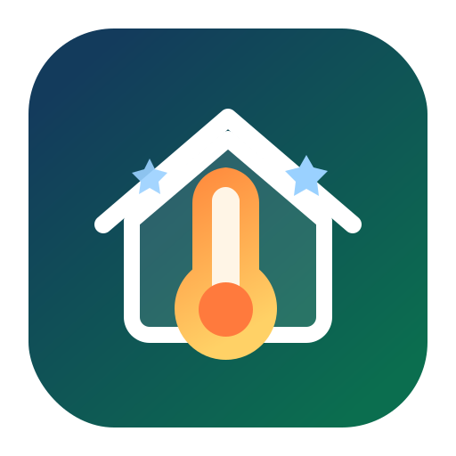

# ATW MINI Home Assistant Integration



Custom Home Assistant integration for the ATW MINI / NeoRe Mini heat pump using local HTTP/XML communication.

## Status

- Raw device captures are kept locally and are not committed to the public repository.
- The device exposes `status.xml` over HTTP Basic Auth.
- The device also exposes `control.xml`, `parameters.htm`, `about.htm`, and `about.xml`.
- The goal is a custom integration compatible with HACS and ready for a public GitHub repository.

## Known Technical Details

- Endpoint: `http://<device_ip>/status.xml`
- Authentication: HTTP Basic Auth
- Response encoding: `windows-1250`
- Confirmed fields:
  - `rtcc`: device timestamp
  - `tep2`: indoor temperature
  - `tep3`: water target temperature
- `tep8`: outdoor temperature
- `pwr`: current heat pump output in percent
- `control.xml` confirmed fields:
  - `st1`: heat pump enabled (`1`) or disabled (`0`)
  - `st2`: operation mode, heating (`1`) or cooling (`2`)
  - `st3`: season mode, summer (`1`) or winter (`2`)
- `parameters.htm`: parameter labels, visible values, internal raw values, and edit limits
- `about.htm` and `about.xml`: firmware and device metadata

Example XML:

```xml
<response>
  <rtcc>Pi  20:15:23  10.04.2026 </rtcc>
  <tep2> 20.4?C</tep2>
  <tep3> 39.2?C</tep3>
  <tep4>  0.0?C</tep4>
  <tep8>  3.2?C</tep8>
  <pwr>73 %</pwr>
  <st1>1</st1>
  <st2>1</st2>
  <st3>0</st3>
  <st4>0</st4>
  <st5>0</st5>
</response>
```

## Repository Contents

- [CHANGELOG.md](/Users/peter.glemba/Documents/Projekty/ATW-MINI-HA/CHANGELOG.md) - release history and version notes
- [docs/hacs-navrh.md](/Users/peter.glemba/Documents/Projekty/ATW-MINI-HA/docs/hacs-navrh.md) - detailed architecture and Home Assistant entity proposal
- [docs/github-project-plan.md](/Users/peter.glemba/Documents/Projekty/ATW-MINI-HA/docs/github-project-plan.md) - recommended GitHub repository, issues, milestones, and project board setup
- [tests/fixtures/status.xml](/Users/peter.glemba/Documents/Projekty/ATW-MINI-HA/tests/fixtures/status.xml) - sanitized sample XML fixture used for parser validation

## Recommended Scope For The First Release

- Read local device state from `status.xml`
- Expose sensors and binary sensors
- Provide UI-based setup through `config_flow`
- Prepare the repository for HACS installation

## Planned Entities

- `sensor.atw_mini_indoor_temperature`
- `sensor.atw_mini_water_target_temperature`
- `sensor.atw_mini_temperature_4`
- `sensor.atw_mini_outdoor_temperature`
- `sensor.atw_mini_power_level`
- `sensor.atw_mini_operation_state`
- `sensor.atw_mini_operation_mode`
- `sensor.atw_mini_season_mode`
- `sensor.atw_mini_firmware_version`
- `sensor.atw_mini_unit_type`
- grouped parameter sensors for heating curve, heating limits, cooling limits, DHW, and advanced values
- `sensor.atw_mini_device_time`
- `binary_sensor.atw_mini_heat_pump_enabled`
- `binary_sensor.atw_mini_defrost`
- `binary_sensor.atw_mini_status_2`
- `binary_sensor.atw_mini_status_3`
- `binary_sensor.atw_mini_status_4`
- `binary_sensor.atw_mini_status_5`

## Notes

- Real device IP addresses and credentials must never be committed.
- `tep4` and `st2` through `st5` still need semantic mapping.
- `st1` is mapped as an operation state sensor: `1 = normal_operation`, `4 = defrost`.
- `control.xml` is now used as a second read-only endpoint for enabled state, heat/cool mode, and summer/winter mode.
- `parameters.htm`, `about.htm`, and `about.xml` are parsed read-only for diagnostics, grouped parameters, and device metadata.
- Write/control endpoints are not yet identified, so the first version should remain read-only.
- Project icon asset: `assets/atw-mini-icon.svg`

## Versioning

- The integration version shown in Home Assistant comes from [manifest.json](/Users/peter.glemba/Documents/Projekty/ATW-MINI-HA/custom_components/atw_mini/manifest.json).
- The current plugin version is `0.3.0`.
- The project follows Semantic Versioning:
  - patch: bug fixes, docs, small compatibility fixes
  - minor: new entities, new features, backward-compatible improvements
  - major: breaking changes to entity names, config, or behavior
- For each public release, update the version in `manifest.json`, add an entry to [CHANGELOG.md](/Users/peter.glemba/Documents/Projekty/ATW-MINI-HA/CHANGELOG.md), create a Git tag, and publish a GitHub release.
